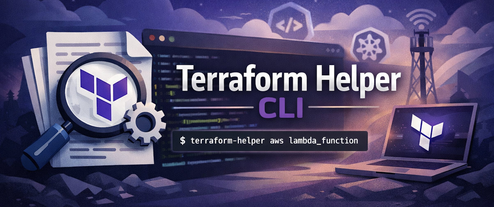

# Terraform Helper CLI

[](https://github.com/giovannirossini/terraform-helper/actions/workflows/main.yml) [](https://github.com/giovannirossini/terraform-helper/actions/workflows/release.yml)


Terraform Helper is a fast, terminal-first CLI written in Go that lets you search and read Terraform and CDK for Terraform (CDKTF) documentation without leaving your shell.

It fetches documentation directly from HashiCorp’s official provider repositories on GitHub and renders it beautifully in the terminal, with smart search and interactive selection when needed.

## Why it exists

Looking up Terraform resources usually means breaking flow: opening a browser, searching docs, navigating pages. Terraform Helper removes that friction by bringing provider docs straight to your terminal.

## Key features

- Smart fuzzy search with exact-match and single-result auto selection
- Works with any Terraform provider (AWS, Google, Azure, HashiCorp Cloud)
- Supports both resources and data sources
- CDKTF documentation support (TypeScript by default, and Python)
- Interactive terminal UI for multiple matches
- Fast GitHub-backed fetching using the Tree API
- Clean, readable markdown rendering with syntax highlighting

## Usage

```sh
terraform-helper   [flags]

terraform-helper aws lambda_function
terraform-helper aws api_gateway
terraform-helper azurerm virtual_machine --datasource
terraform-helper aws s3_bucket –-cdktf
terraform-helper google compute_instance –-cdktf python
```

## Flags

- `-r, --resource`   Search resources (default)
- `-d, --datasource` Search data sources
- `--cdktf, --cdktf [lang]`   Use CDKTF docs (default: typescript)
- `-h, --help`       Show help

## Installation

```sh
» make

Installing dependencies...
go mod download
go mod tidy
Building terraform-helper without cache...
go build -a -o terraform-helper .
Moving to /usr/local/bin
sudo mv terraform-helper /usr/local/bin
Password:
Cleaning...
rm -f terraform-helper
go clean -cache
```

## Design philosophy

- Zero configuration, works out of the box
- Always up to date by using GitHub as the source of truth
- Optimized for speed and minimal keystrokes
- Clear separation of concerns and clean Go code

Terraform Helper is built for engineers who live in the terminal and want instant access to Terraform and CDKTF docs without context switching.

## Demo

https://github.com/user-attachments/assets/398b17d5-daf6-4133-8d59-f97324f78f5e
